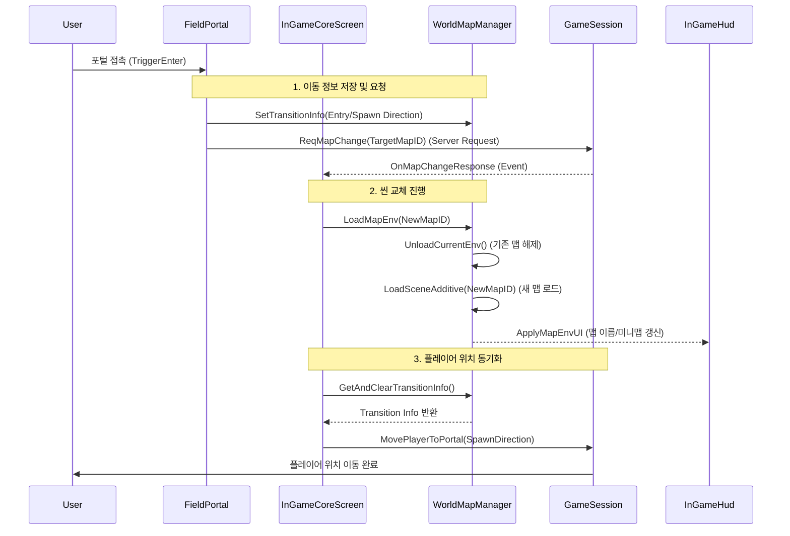

# 2. HuntVerse (헌트버스) | 프레임워크 설계 (맵 로딩 시스템)

본 문서는 **HuntVerse**의 월드 맵 로딩 및 씬 관리 시스템의 아키텍처를 기술합니다. 이 시스템은 **Core 씬의 지속성(Persistence)**과 **Additive 씬 로딩**을 결합하여, 끊김 없는 게임플레이 경험과 효율적인 리소스 관리를 제공합니다.

---

## 🏗️ 설계 방향 (Design Philosophy)

맵 로딩 시스템은 **단일 코어(Single Core)** 구조를 기반으로, 환경(Environment)만 교체하는 방식을 채택했습니다.

### 1. Core 씬 중심의 Additive 로딩 (Core-Based Additive Loading)
- **Persistent Core**: [InGameCoreScreen.cs](../Screen/InGameCoreScreen.cs)이 존재하는 **Core 씬**은 게임 내내 유지됩니다. 공통 HUD, 전역 매니저(Network, Sound), 플레이어 캐릭터 등은 언로드되지 않습니다.
- **Dynamic Content**: 마을(`Village`)이나 필드 던전(`FieldDungeon`) 등의 구체적인 맵 데이터는 **Additive** 모드로 로드되며, 이동 시 이전 맵만 언로드하고 새 맵을 로드합니다.
- **이점**: 씬 전환 시 재로딩해야 할 리소스를 최소화하여 로딩 속도를 비약적으로 향상시키고, BGM이나 UI 상태가 끊기지 않습니다.

### 2. 맵 ID 기반의 데이터 관리 (ID-Based Management)
- 단순한 씬 이름이 아닌, 기획 데이터(CSV)와 연동된 **Map ID**(`uint`)를 통해 씬을 관리합니다.
- **[WorldMapManager.cs](../Service/Manage/WorldMapManager.cs)**는 `Map ID`를 `AssetBundle Key` 또는 `Scene Name`으로 변환(`GetEnvKey`)하여 적절한 환경을 로드합니다.
- **이점**: 동일한 '숲' 테마의 씬이라도 ID에 따라 다른 몬스터 배치나 환경 설정을 가질 수 있어 확장성이 뛰어납니다.

### 3. 클라이언트 예측 이동 및 위치 보정 (Transition & Positioning)
- 포털 이동 시, 클라이언트는 **[FieldTransitionInfo](../Contents/Map/FieldPortal.cs)**를 통해 "어디서 왔는지(진입 방향)"와 "어디로 갈지(목표 맵)"를 미리 저장합니다.
- 새 맵이 로드되면, 저장된 정보를 바탕으로 플레이어를 해당 포털의 반대편(Spawn Point)에 즉시 위치시킵니다.

---

## 🔄 아키텍처 흐름 (Architecture Flow)

[WorldMapManager.cs](../Service/Manage/WorldMapManager.cs)가 씬 관리의 중추 역할을 하며, [GameSession.cs](../Network/Session/GameSession.cs)과 연동하여 플레이어의 스폰 및 이동을 제어합니다.



---

## 📂 핵심 컴포넌트 구현 (Key Components Implementation)

### 1. 맵 매니저: [WorldMapManager.cs](../Service/Manage/WorldMapManager.cs)
환경 씬의 로드와 언로드를 전담하는 매니저입니다. 현재 로드된 환경을 추적하고, 전환 정보를 임시 저장합니다.

<details>
<summary>📄 WorldMapManager.cs 코드 확인하기</summary>

```csharp
// 맵 환경 로드 (이전 환경 언로드 -> 새 환경 Additive 로드)
public async UniTask LoadMapEnv(uint mapId, SceneType sceneType)
{
    if (isLoadingEnv) return;
    
    // 1. 기존 환경 언로드
    if (currentEnvScene.Scene.IsValid())
    {
        await SceneLoadHelper.Shared.UnloadSceneAdditive(currentEnvScene);
    }

    // 2. 새 환경 키(Addressable/SceneName) 획득 및 로드
    string envKey = GetEnvKey(mapId, sceneType);
    currentEnvScene = await SceneLoadHelper.Shared.LoadSceneAdditiveMode(envKey);

    // 3. UI 갱신 (맵 이름 등)
    await ApplyMapEnvUI(mapId);
}

// 씬 전환 정보 저장 (포털 진입 시 호출)
public void SetTransitionInfo(FieldTransitionInfo info)
{
    currentTransition = info; // 다음 씬에서 플레이어가 서있어야 할 위치 정보
}
```

</details>

### 2. 코어 스크린: [InGameCoreScreen.cs](../Screen/InGameCoreScreen.cs)
게임의 메인 루프를 담당하는 컨트롤러입니다. 서버로부터 맵 변경 응답이 오면 실제 로딩 프로세스를 트리거합니다.

<details>
<summary>📄 InGameCoreScreen.cs 코드 확인하기</summary>

```csharp
// 서버 응답 핸들러
private void OnMapChangeResponse(ErrorType errorType, uint newMapId)
{
    if (errorType == ErrorType.ErrNon)
    {
        // Core 씬은 유지한 채, Env만 교체
        ReplaceEnvByMapId(newMapId).Forget();
    }
}

private async UniTaskVoid ReplaceEnvByMapId(uint mapId)
{
    // 1. 맵 로드
    await WorldMapManager.Shared.LoadMapEnv(mapId, ...);
    
    // 2. 플레이어 위치 보정
    PositionPlayerAtPortal();
    
    // 3. BGM 및 HUD 갱신
    RefreshHUD();
}
```

</details>

### 3. 포털 객체: [FieldPortal.cs](../Contents/Map/FieldPortal.cs)
물리적 포털 오브젝트로, 충돌 시 이동 로직을 시작합니다.

<details>
<summary>📄 FieldPortal.cs 코드 확인하기</summary>

```csharp
private void OnTriggerEnter2D(Collider2D collision)
{
    if (collision.CompareTag("Player") && collision.IsLocalPlayer())
    {
        // 이동 정보 생성 (진입 방향 -> 스폰 방향 계산)
        FieldTransitionInfo info = new FieldTransitionInfo
        {
            targetMapId = targetMapId,
            spawnDirection = GetOppositeDirection(direction) // 반대편에 스폰
        };
        
        // 로컬에 정보 저장 후 서버 요청
        WorldMapManager.Shared.SetTransitionInfo(info);
        GameSession.Shared.InGameService.ReqMapChange(targetMapId);
    }
}
```

</details>

### 4. 씬별 컨트롤러: [VillageScreen.cs](../Screen/Village/VillageScreen.cs) / [FieldDungeonScreen.cs](../Screen/FieldDungeon/FieldDungeonScreen.cs)
각 환경 씬(`Env`)에 부착되어 해당 맵의 고유한 연출(카메라 세팅, 특정 NPC 로드 등)을 담당합니다. `Core` 씬과 함께 로드될 때는 충돌을 방지하기 위해 로직을 스킵하거나 보조적인 역할만 수행합니다.

---

## 🚀 요약 및 강점

| 특징 | 구현 방식 | 기대 효과 |
| :--- | :--- | :--- |
| **Seamless Play** | `Additive Scene` | 공통 리소스(UI, Player)를 유지하여 체감 로딩 시간 단축 |
| **정확한 스폰** | `TransitionInfo` | 포털 진입/진출 방향을 계산하여 자연스러운 맵 이동 연출 |
| **확장성** | `Map ID System` | 맵 리소스와 기획 데이터의 분리로 방대한 월드 관리 용이 |
| **안정성** | `Single Core` | 씬 전환 중에도 네트워크 연결이나 글로벌 상태가 끊어지지 않음 |
