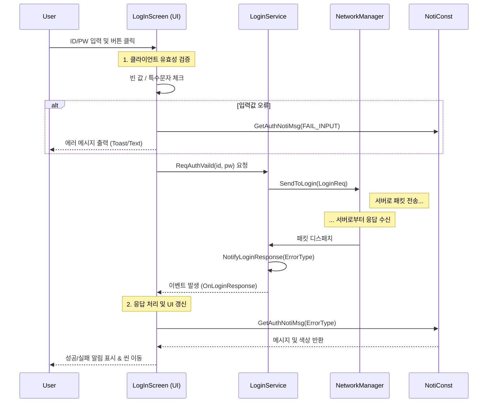

# 1. HuntVerse (헌트버스) | 프레임워크 설계 (계정 로그인 및 생성)

본 문서는 **HuntVerse**의 계정 로그인 및 생성 시스템의 아키텍처와 설계 철학을 기술합니다. 이 프레임워크는 **관심사의 분리(Separation of Concerns)**, **서버 부하 최소화**, **유지보수의 효율성**을 최우선으로 고려하여 설계되었습니다.

---

## 🏗️ 설계 방향 (Design Philosophy)

로그인 프레임워크는 **프레젠테이션 계층(UI)**과 **비즈니스 로직/네트워크 계층**을 엄격하게 분리하여 구현되었습니다.

### 1. UI와 네트워크 로직의 완전한 분리 (Decoupled UI & Network Logic)
- **UI ([LogInScreen.cs](Screen/LogIn/LogInScreen.cs))**: 사용자의 입력(Input), 애니메이션, 이벤트에 따른 시각적 피드백만을 담당합니다.
- **Service ([LoginService.cs](Network/Auth/LoginService.cs))**: 실제 데이터 처리, 패킷 생성, 서버 통신을 담당합니다.
- **이점**: UI는 서버의 패킷 구조(`LoginReq`, `CreateAccountReq` 등)를 전혀 몰라도 됩니다. 따라서 네트워크 로직을 수정하지 않고도 UI 디자인을 전면 개편(Reskin)하거나 교체하는 것이 매우 용이합니다.

### 2. 중앙 집중식 에러 및 알림 관리 (Centralized Error & Notification Handling)
- 서버의 응답은 주로 `ErrorType` (Enum) 형태로 수신됩니다.
- **[NotiConst.cs](Common/NotiConst.cs)** 클래스가 이 에러 코드를 사용자에게 보여줄 '메시지'와 '색상(Color)'으로 변환하는 단일 소스(Source of Truth) 역할을 합니다.
- **이점**: 모든 알림 메시지가 한 곳에서 관리되므로, 문구 수정이나 다국어 처리(Localization) 시 `NotiConst.cs` 파일 하나만 수정하면 프로젝트 전체에 반영됩니다.

### 3. 클라이언트 1차 검증 (Client-Side Validation)
- 서버로 요청을 보내기 전, 클라이언트에서 입력값에 대한 유효성 검사(빈 값, 특수문자 포함 여부, 비밀번호 불일치 등)를 선행합니다.
- **이점**: 잘못된 요청이 서버에 도달하는 것을 원천 차단하여 불필요한 네트워크 트래픽과 서버 연산 부하를 획기적으로 줄입니다.

---

## 🔄 아키텍처 흐름 (Architecture Flow)

데이터의 흐름은 UI가 Service를 호출하되, Service는 UI에 대해 알지 못하고 오직 **Event**를 통해서만 응답을 전달하는 단방향 의존성을 가집니다.



---

## 📂 핵심 컴포넌트 구현 (Key Components Implementation)

### 1. UI 계층: [LogInScreen.cs](Screen/LogIn/LogInScreen.cs)
뷰 컨트롤러 역할을 하며, 사용자의 입력을 받고 서비스의 이벤트를 구독합니다.

*   **이벤트 기반 응답 처리:** 네트워크 콜백을 직접 받지 않고, `LoginService`의 C# Event를 구독하여 처리합니다.
*   **시각적 피드백:** `Animator`와 `UIEffect`를 통해 부드러운 전환 효과를 제공합니다.

<details>
<summary>📄 LogInScreen.cs 코드 확인하기</summary>

```csharp
// 예시: 로그인 응답 이벤트 구독
private void OnEnable()
{
    LoginService.OnLoginResponse += HandleNotiLoginResponse;
}

// ErrorType에 따라 UI 처리 분기 (중앙 관리형 메시지 사용)
private void HandleNotiLoginResponse(ErrorType t)
{
    switch (t)
    {
        case Common.ErrorType.ErrNon:
            // 로그인 성공 처리 (씬 이동 등)
            break;
        case Common.ErrorType.ErrAccountNotExist:
            // NotiConst에서 에러 메시지와 경고 컬러를 가져와 출력
            ShowNotificationText(
                loginVaildText,
                NotiConst.GetAuthNotiMsg(AUTH_NOTI_TYPE.ACCOUNT_NOT_EXIST),
                NotiConst.COLOR_WARNNING);
            break;
    }
}
```

</details>

### 2. 서비스 계층: [LoginService.cs](Network/Auth/LoginService.cs)
비즈니스 로직을 캡슐화한 클래스입니다.

*   **파사드 패턴 (Facade Pattern):** UI에는 `ReqAuthVaild(id, pw)`와 같이 단순한 메서드만 노출하고, 내부적으로 `LoginReq` 패킷 생성 및 프로토콜 처리를 수행합니다.
*   **비동기 안전성 (UniTask):** `UniTask`를 활용하여 네트워크 응답이 왔을 때 메인 스레드(`SwitchToMainThread`)에서 이벤트가 발생하도록 보장합니다.

<details>
<summary>📄 LoginService.cs 코드 확인하기</summary>

```csharp
// 요청: UI는 이 메서드만 호출하면 됨
public void ReqAuthVaild(string id, string pw)
{
    var req = new LoginReq { Id = id, Pw = pw };
    // 실제 TCP 전송은 NetworkManager에게 위임
    networkManager.SendToLogin(Hunt.Common.MsgId.LoginReq, req);
}

// 응답: UI가 구독 중인 이벤트를 메인 스레드에서 안전하게 호출
private static async UniTaskVoid NotifyLoginResponseAsync(ErrorType t)
{
    await UniTask.SwitchToMainThread();
    OnLoginResponse?.Invoke(t);
}
```

</details>

### 3. 상수 및 메시지 관리: [NotiConst.cs](Common/NotiConst.cs)
서버의 에러 코드나 내부 타입을 사용자 친화적인 메시지로 변환하는 정적 헬퍼 클래스입니다.

<details>
<summary>📄 NotiConst.cs 코드 확인하기</summary>

```csharp
public static string GetAuthNotiMsg(AUTH_NOTI_TYPE type)
{
    return type switch
    {
        AUTH_NOTI_TYPE.FAIL_INPUT => "특수문자(#, -, 공백)는 입력할 수 없습니다.",
        AUTH_NOTI_TYPE.ACCOUNT_NOT_EXIST => "해당 계정을 찾을 수 없습니다.",
        AUTH_NOTI_TYPE.SUCCESS_VAILD => "환영합니다, 헌터님.",
        _ => string.Empty
    };
}
```

</details>

### 4. 네트워크 매니저: [NetworkManager.cs](Network/NetworkManager.cs) & [GameSession.cs](Network/Session/GameSession.cs)
*   **[GameSession.cs](Network/Session/GameSession.cs):** 게임의 라이프사이클을 관리하는 싱글톤입니다. `LoginService`를 초기화하고 보유하여, 게임 내 어디서든 로그인 서비스에 접근할 수 있게 합니다.
*   **[NetworkManager.cs](Network/NetworkManager.cs):** `ConcurrentDictionary`를 사용해 로그인 서버, 게임 서버 등 다중 연결을 스레드 안전(Thread-Safe)하게 관리합니다.

---

## 🚀 요약 및 강점

| 특징 | 구현 방식 | 기대 효과 |
| :--- | :--- | :--- |
| **유지보수성** | `NotiConst` | 에러 메시지 수정 시 코드 탐색 없이 한 곳에서 즉시 반영 가능 |
| **확장성** | `LoginService` | UI 수정 없이 새로운 인증 방식(2FA, 소셜 로그인 등) 추가 용이 |
| **성능 최적화** | `Client Validation` | 잘못된 요청의 서버 전송을 차단하여 서버 리소스 절약 |
| **반응성** | `UniTask` | 비동기 처리를 통해 네트워크 대기 중에도 클라이언트가 멈추지 않음 |
