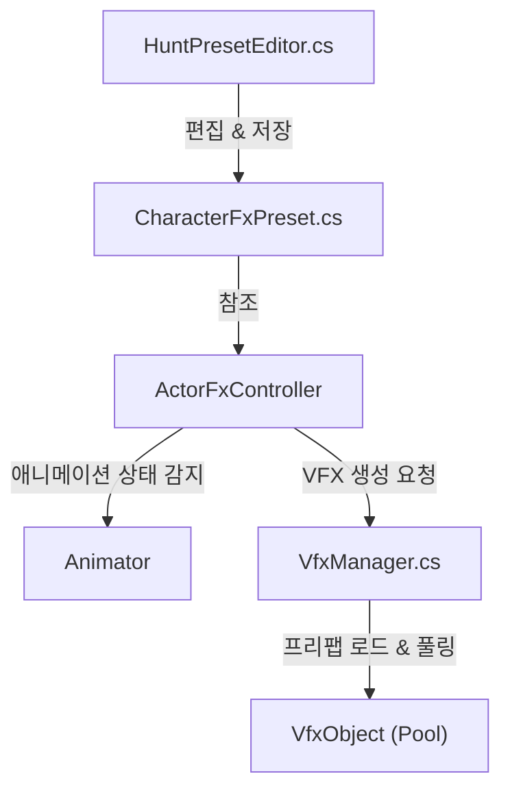

# HuntVerse VFX 시스템 구조 분석

이 문서는 프로젝트의 VFX 시스템이 어떻게 구성되어 있고, 데이터가 흐르는지를 설명합니다.  
**Editor(툴)** 에서 데이터를 설정하고, **Data(프리셋)** 에 저장하며, **Runtime(인게임)** 에서 이를 재생하는 구조입니다.

---

## 0. 배경 및 설계 의도 (Background & Design Intent)

### 🛑 기존 방식의 문제점 (Problem)
유니티의 기본 **Animation Event** 시스템을 직접 사용할 때 발생하는 문제점들을 해결하기 위해 설계되었습니다.

1.  **유지보수의 어려움**: 
    *   이벤트가 `.anim` 파일 내부에 숨겨져 있어, 어떤 클립에 어떤 효과가 있는지 한눈에 파악하기 어렵습니다.
    *   함수 이름 변경 시 모든 애니메이션 클립을 찾아다니며 문자열(String)을 수정해야 합니다.
2.  **작업 효율 저하 (No Preview)**:
    *   이펙트가 정확한 타이밍(프레임)에 나오는지 확인하려면 매번 게임을 실행해야 합니다.
    *   기획자나 아티스트가 이펙트를 수정하려면 프로그래머의 도움이 필요하거나 복잡한 과정을 거쳐야 합니다.
3.  **하드코딩 및 결합도 증가**:
    *   `Player.cs` 같은 코드 안에 `SpawnVfx("Slash")` 등을 하드코딩하면 로직과 연출이 강하게 결합되어 관리가 힘듭니다.

### ✅ 해결 방안 및 개선점 (Solution)
이 시스템은 **데이터 기반(Data-Driven)** 접근 방식과 **전용 에디터**를 통해 위 문제들을 해결했습니다.

1.  **시각적 에디터 (Visual Editor)**:
    *   `HuntPresetEditor`를 통해 애니메이션 타임라인을 슬라이더로 조절하며 **즉시 미리보기(Preview)** 가 가능합니다.
    *   게임을 실행하지 않고도 이펙트와 사운드의 싱크를 정확하게 맞출 수 있습니다.
2.  **데이터의 중앙화 (Centralized Data)**:
    *   모든 연출 데이터가 `CharacterFxPreset` (ScriptableObject)에 모여 있어 관리가 용이합니다.
    *   애니메이션 클립 원본을 수정하지 않으므로 버전 관리(SVN/Git) 충돌이 줄어듭니다.
3.  **타입 안전성 및 자동화**:
    *   문자열 입력 대신 `VfxType` (Enum)을 사용하여 오타 실수를 방지합니다.
    *   `VfxManager`가 내부적으로 오브젝트 풀링(Object Pooling)을 자동 처리하여 최적화 신경을 덜 써도 됩니다.

---

---

## 1. 전체 구조 (Architecture)



### 핵심 구성 요소
1. **Data (`CharacterFxPreset.cs`)**: 어떤 애니메이션의 몇 초에, 어떤 이펙트/소리를 낼지 정의하는 데이터.
2. **Tool (`HuntPresetEditor.cs`)**: 개발자가 이 데이터를 쉽게 입력하도록 돕는 유니티 에디터 창. (타임라인 프리뷰 기능 제공)
3. **Service (`VfxManager.cs`)**: 실제 이펙트 오브젝트(GameObject)를 로드하고, 생성하고, 재사용(Object Pooling)하는 매니저.

---

## 2. 파일별 상세 분석 및 코드 콜아웃

### A. 데이터 정의: `CharacterFxPreset.cs`
애니메이션 클립별로 FX 타이밍을 저장하는 ScriptableObject입니다.

> **핵심 역할**: 애니메이션 이름(`clipName`)과 타이밍(`FxTiming`) 매핑.

```csharp
// [HuntVerse/Tool/FXPreset/Editor/CharacterFxPreset.cs]

// 캐릭터 하나가 가지는 전체 VFX/SFX 설정
public class CharacterFxPreset : ScriptableObject
{
    public GameObject characterPrefab; // 미리보기용 프리팹
    public List<ClipFxData> clipFxDataList = new List<ClipFxData>(); // 클립별 설정 리스트
}

[Serializable]
public class ClipFxData
{
    public string clipName; // "Attack01" 같은 클립 이름
    public List<FxTiming> fxTimings = new List<FxTiming>();
}

[Serializable]
public class FxTiming
{
    public float timeInSeconds;   // "0.5초 지점"
    public VfxType vfxType;       // "SlashEffect"
    public AudioType audioType;   // "SwingSound"
    public bool attachHit;        // 캐릭터에 붙어서 따라다닐지 여부
}
```

---

## 3. 에디터 툴: `HuntPresetEditor.cs`
데이터를 직관적으로 편집하기 위해 만든 커스텀 에디터입니다. Odin Inspector를 기반으로 하며, **왼쪽 패널에서 애니메이션을 실시간으로 미리보며 이펙트 타이밍을 설정하는 기능**이 핵심입니다.

> **핵심 기능**: 
> - **실시간 애니메이션 미리보기**: 2D 스프라이트와 3D 모델 모두 지원
> - **자동 인스턴스 생성**: 클립 선택 시 자동으로 미리보기 생성
> - **비주얼 타임라인**: 슬라이더로 정확한 타이밍 조절

```csharp
// [HuntVerse/Tool/FXPreset/Editor/HuntPresetEditor.cs]

// 왼쪽 패널에 애니메이션 미리보기 렌더링 (2D/3D 자동 감지)
private void DrawLeftPanelPreview()
{
    // 클립 선택 시 자동으로 미리보기 인스턴스 생성
    if (_currentClip != null && _previewInstance == null)
    {
        CreatePreviewInstance();
    }
    
    if (_previewInstance != null && _previewRenderUtility != null)
    {
        Rect previewRect = GUILayoutUtility.GetRect(300, 300);
        RenderPreview(previewRect); // 2D 스프라이트 또는 3D 메시 렌더링
    }
}

// 2D 스프라이트 렌더링
private void Render2DSprite(Rect previewRect, SpriteRenderer[] spriteRenderers)
{
    var mainSprite = spriteRenderers[0].sprite;
    // UV 좌표 계산 및 종횡비 유지하며 그리기
    GUI.DrawTextureWithTexCoords(drawRect, spriteTexture, uv);
}

// 3D 메시 렌더링 (SkinnedMeshRenderer 지원)
private void Render3DMesh(Rect previewRect)
{
    foreach (var renderer in renderers)
    {
        Mesh mesh = GetMeshFromRenderer(renderer);
        // SkinnedMeshRenderer의 경우 BakeMesh()로 현재 포즈 가져오기
        if (renderer is SkinnedMeshRenderer skinnedMeshRenderer)
        {
            skinnedMeshRenderer.BakeMesh(bakedMesh);
        }
        _previewRenderUtility.DrawMesh(mesh, transform, material, subMeshIndex);
    }
    _previewRenderUtility.camera.Render();
}

// 애니메이션 샘플링 (타임라인 슬라이더 이동 시 호출)
private void SampleAnimation()
{
    if (_previewInstance != null && _previewInstance != null)
    {
        _currentClip.SampleAnimation(_previewInstance, _previewTime);
        Repaint(); // 미리보기 업데이트
    }
}

// "Add Event Here" 버튼 클릭 시 현재 시간에 이벤트 추가
private void AddEventAtCurrentTime()
{
    clipData.fxTimings.Add(new FxTiming
    {
        timeInSeconds = _previewTime,
        vfxType = VfxType.None
    });
}
```

### 사용 플로우
1. Unity 메뉴 → Tools → Hunt → Open HuntPreset
2. 액터 프리팹 선택 → Create New Preset (또는 기존 프리셋 선택)
3. 편집할 클립 선택 → **왼쪽에 미리보기 자동 표시**
4. Play 버튼 → 애니메이션 확인
5. 타임라인 슬라이더 → 원하는 타이밍으로 이동
6. Add Event Here → VFX Type, Audio Type 설정
7. Save Preset → 완료

### HuntPresetEditor UI 스크린샷


**UI 구성 요소**:
- **왼쪽 패널**: 실시간 캐릭터 애니메이션 미리보기 (2D/3D 자동 감지)
- **오른쪽 상단**: 액터 프리셋 선택 및 클립 목록
- **오른쪽 중앙**: 각 클립의 FX 타이밍 설정 (Time, VfxType, AudioType, Attach Hit)
- **하단**: 애니메이션 타임라인 슬라이더 (Play/Pause, Add Event Here 버튼)

---

## 4. 런타임 컨트롤러 비교

프로젝트에는 두 가지 VFX 트리거 방식이 공존합니다.

### A. FxOrchestrator (레거시 방식)

**개념**: Animation Event → `AnimationVfxEventReceiver` → `FxOrchestrator.OnAnimEvent()` → VFX 재생

**장점**:
- 기존 애니메이션 클립 호환
- Animation Event가 이미 설정된 경우 바로 사용 가능

**단점**:
- Animation Event를 클립에 직접 추가해야 함
- eventId 하드코딩 필요
- 미리보기 불가능

**사용 대상**: 기존 캐릭터, 레거시 콘텐츠

### B. ActorFxController (권장 방식)

**개념**: `CharacterFxPreset` 데이터 → `ActorFxController.Update()` → 타이밍 자동 감지 → VFX 재생

**장점**:
- HuntPresetEditor로 비주얼 편집 및 미리보기
- 데이터 기반이라 코드 수정 불필요
- Animation Event 없이 자동 동기화

**단점**:
- 새로운 시스템이라 기존 콘텐츠 마이그레이션 필요

**사용 대상**: **모든 새로운 캐릭터 (권장)**

### 런타임 동작 플로우 (ActorFxController)

1. 캐릭터 프리팹에 `ActorFxController` 컴포넌트 추가
2. `ActorFxController.Init(CharacterFxPreset)` 호출 → Preset 로드
3. 게임 플레이 시작 → 캐릭터 애니메이션 재생
4. `ActorFxController.Update()` → Animator 상태 감시
5. 설정된 타이밍 도달 → `VfxManager.PlayOneShot()` 자동 호출
6. VFX/SFX 화면에 표시 → 완료

---

## 5. 런타임 매니저: `VfxManager.cs`
실제로 게임 내에서 이펙트를 쏘는 역할을 합니다. 데이터(`CharacterFxPreset`)를 직접 알지 못하며, **"어떤 키(Key)의 이펙트를 어디(Position)에 틀어라"** 라는 명령만 수행합니다.

> **핵심 기능**: 비동기 로드(UniTask), 오브젝트 풀링(ObjectPool), 부모/위치 설정.

```csharp
// [HuntVerse/Service/Manage/VfxManager.cs]

// 이펙트 재생 요청 처리
public async UniTask<VfxHandle> PlayOneShot(string key, Vector3 pos, Quaternion rot, Transform parent = null)
{
    // 1. 프리팹 로드 (없으면 캐시 조회)
    var vfxObj = await GetOrLoadVfxObject(key);
    
    // 2. 오브젝트 풀에서 하나 꺼내옴
    var pool = GetPool(key, vfxObj);
    var vfxInstance = pool.Get();

    // 3. 위치 및 회전 설정
    if (parent != null)
    {
        // attachHit=true 인 경우, 부모를 따라다니도록 설정
        vfxInstance.transform.SetParent(parent);
        vfxInstance.transform.localPosition = spawnOffset;
    }
    else
    {
        // 월드 좌표에 고정
        vfxInstance.transform.position = pos + rot * spawnOffset;
        vfxInstance.transform.rotation = rot;
    }

    // 4. 초기화 및 반환 (종료 시 풀로 반납하는 콜백 등록)
    vfxInstance.Init(() => { pool.Release(vfxInstance); });

    return new VfxHandle(vfxInstance);
}
```

---

## 6. 전체 처리 과정 (Process Flow)

개발자가 에디터에서 설정하는 단계부터 인게임에서 발동되는 순간까지의 흐름입니다.

1.  **[Tool]** 캐릭터 프리셋(`.asset`) 생성 및 에디터(`HuntPresetEditor`) 실행
2.  **[Tool]** 타겟 캐릭터 프리팹(`GameObject`) 연결 (자동으로 Animator 분석)
3.  **[Tool]** 애니메이션 클립 선택 및 타임라인 슬라이더 조절 (Preview)
4.  **[Tool]** 원하는 타이밍(Time)에 `VfxType` / `AudioType` 키 추가 및 저장
5.  **[Build]** 프리셋 데이터(`CharacterFxPreset`)가 Addressable 그룹에 자동 등록됨
6.  **[Runtime]** 게임 시작 시 캐릭터에 붙은 `ActorFxController` 초기화
7.  **[Runtime]** `ActorFxController`가 `CharacterFxPreset` 데이터를 로드하여 캐싱
8.  **[Runtime]** 매 프레임(`Update`) 현재 애니메이션 시간과 프리셋 타이밍 비교
9.  **[Runtime]** 타이밍 일치 시 `VfxManager`에게 `PlayOneShot` 요청 (풀링된 객체 사용)
10. **[Runtime]** 이펙트 재생 완료 후 자동으로 비활성화 및 풀 반납
